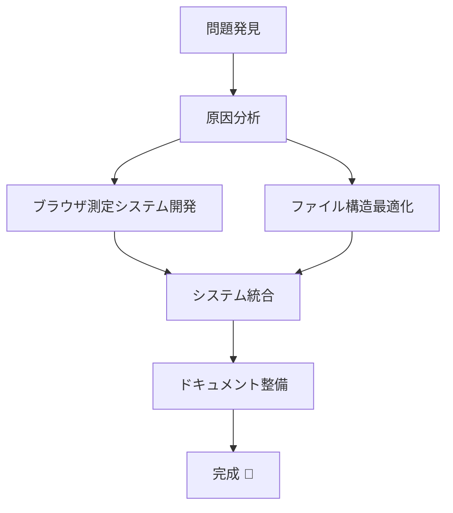

# 📚 Router Performance Check ドキュメント

> **このディレクトリについて**: Router Performance Check プロジェクトの改善内容と利用方法をまとめたドキュメント集です。

## 🎯 はじめに

このプロジェクトでは、React Router v7 と TanStack Router の性能比較において、**実際のユーザー体験を正確に反映する測定システム**を構築しました。

**主な改善:**

- ✅ ブラウザベース自動測定システムの導入
- ✅ performance-results 構造の最適化
- ✅ 包括的なドキュメント整備

## 📖 ドキュメント一覧

### 🚀 クイックスタート

**すぐに使い始めたい方**

➡️ **[包括的利用ガイド](./comprehensive-performance-guide.md)**

- 全体の概要から詳細な利用方法まで
- トラブルシューティング
- ベストプラクティス

### 🔍 詳細ドキュメント

#### 1. 問題分析と解決策

➡️ **[パフォーマンス測定の問題解決と改善](./performance-measurement-improvements.md)**

- 発見された問題の詳細分析
- 根本原因の特定
- 実装した解決策の効果

#### 2. 技術実装の詳細

➡️ **[ブラウザベース パフォーマンス測定システム](./browser-based-performance-testing.md)**

- Puppeteer ベース測定システムの技術詳細
- Web Vitals 測定の実装
- 結果ファイルフォーマット

#### 3. ファイル構造の改善

➡️ **[Performance Results ファイル構造の最適化](./file-structure-optimization.md)**

- 改善前後の構造比較
- 自動化された保存システム
- 利用ガイドの整備

## 🎯 目的別の読み方

### 👨‍💻 開発者向け

**新しくプロジェクトに参加する開発者**

1. [包括的利用ガイド](./comprehensive-performance-guide.md) - 全体把握
2. [ブラウザベース測定システム](./browser-based-performance-testing.md) - 技術詳細

**既存の測定方法に疑問を持った開発者**

1. [パフォーマンス測定の問題解決](./performance-measurement-improvements.md) - 問題の背景
2. [包括的利用ガイド](./comprehensive-performance-guide.md) - 新しい方法

### 📊 性能分析者向け

**測定結果の解釈を知りたい**

1. [包括的利用ガイド](./comprehensive-performance-guide.md) - 結果の見方
2. [ブラウザベース測定システム](./browser-based-performance-testing.md) - 指標の詳細

**継続的な監視体制を構築したい**

1. [ファイル構造の最適化](./file-structure-optimization.md) - 履歴管理
2. [包括的利用ガイド](./comprehensive-performance-guide.md) - ベストプラクティス

### 🏗️ システム管理者向け

**CI/CD 統合を検討している**

1. [包括的利用ガイド](./comprehensive-performance-guide.md) - 高度な利用方法
2. [ブラウザベース測定システム](./browser-based-performance-testing.md) - 自動化の詳細

## 📋 改善の全体像

### Timeline: 2025 年 8 月 7 日の改善



### 改善前 vs 改善後

| 項目             | 改善前                | 改善後            |
| ---------------- | --------------------- | ----------------- |
| **測定精度**     | ❌ バンドルサイズのみ | ✅ 実ブラウザ測定 |
| **結果管理**     | ❌ ファイル散乱       | ✅ 明瞭な構造     |
| **自動化**       | △ 部分的              | ✅ 完全自動化     |
| **ドキュメント** | ❌ 最小限             | ✅ 包括的         |

## 🚀 実際の成果

### 測定結果の例（2025 年 8 月 7 日時点）

| 項目               | React Router   | TanStack Router | 勝者                |
| ------------------ | -------------- | --------------- | ------------------- |
| **ページロード**   | 5,627ms        | **4,934ms** ⚡  | **TanStack Router** |
| **データ転送**     | **5.95KB** ⚡  | 10.25KB         | **React Router**    |
| **ナビゲーション** | **1,039ms** ⚡ | 1,079ms         | **React Router**    |

**重要な発見**: ユーザーの体感（TanStack Router が高速）が実測で証明された

### 構造改善の成果

```bash
# 改善後の明瞭な構造
performance-results/
├── 📄 latest-browser-performance.json      # ⭐ 一目で分かるメイン結果
├── 📄 latest-build-performance.json        # 📊 補助的なビルド結果
├── 📄 README.md                            # 📖 親切なガイダンス
└── 📁 history/                             # 📚 整理された履歴
```

## 🔧 使用方法（クイックリファレンス）

### 基本的な測定

```bash
# 1. 開発サーバー起動
npm run dev

# 2. ブラウザ性能測定（最重要）
npm run test:performance:browser

# 3. 結果確認
cat performance-results/latest-browser-performance.json
```

### トラブル時の対応

```bash
# サーバーエラー → 個別起動で確認
npm run dev:react-router
npm run dev:tanstack-router

# 依存関係エラー → クリーンインストール
npm run clean && npm run install:all && npm run setup

# 結果の見方が分からない → ガイド確認
cat performance-results/README.md
```

## 📈 今後の計画

### 次のステップ

1. **Lighthouse 統合**: より包括的な性能評価
2. **モバイル測定**: モバイル環境での性能比較
3. **CI/CD 統合**: 自動的な性能回帰検出

### 継続的改善

- **定期測定**: 月 1 回の性能チェック
- **履歴分析**: 性能トレンドの追跡
- **ドキュメント更新**: 新機能追加時の文書化

## 🤝 貢献ガイド

### ドキュメントの改善

このドキュメント集は継続的に改善していきます：

1. **新機能追加時**: 対応するドキュメントの更新
2. **問題発見時**: トラブルシューティングの追加
3. **最適化実施時**: ベストプラクティスの更新

### フィードバック

- 不明な点や改善提案があれば Issue や PR でお知らせください
- 実際の利用体験に基づいたドキュメント改善を歓迎します

## 📞 サポート

### 困った時の対応順序

1. **`performance-results/README.md`** - 結果の見方
2. **[包括的利用ガイド](./comprehensive-performance-guide.md)** - 全般的な疑問
3. **各詳細ドキュメント** - 特定分野の深い情報
4. **Issue 作成** - 解決しない問題

---

**最終更新**: 2025 年 8 月 7 日  
**メンテナ**: Router Performance Check プロジェクトチーム
